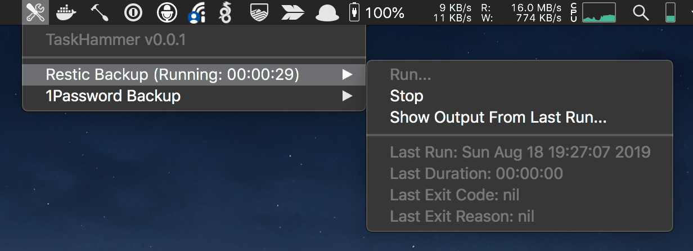

TaskHammer.spoon
================

[](https://circleci.com/gh/joemiller/taskhammer)

A Hammerspoon](https://www.hammerspoon.org) module for running scripts from macOS's menu bar



Install
-------

Install [Hammerspoon](https://www.hammerspoon.org)

**Recommended**: If you're using the `SpoonInstall` spoon, add to `~/.hammerspoon/init.lua`:

```lua
hs.loadSpoon("SpoonInstall")
Install = spoon.SpoonInstall

-- Register the repository
Install.repos["TaskHammer"] = {
  desc = "TaskHammer.spoon repository",
  url = "https://github.com/joemiller/taskhammer"
}

-- Download, load, configure and start:
Install:andUse("TaskHammer",
    {
        repo = "TaskHammer",
        start = true,
        config = {
            tasks = { ... } -- configure tasks here. See below for details.
        }
    }
)
```

**Alternative**:

* download [TaskHammer.spoon.zip](https://github.com/joemiller/taskhammer/raw/master/Spoons/TaskHammer.spoon.zip) and extract.
* Double-click or open `TaskHammer.spoon` and Hammerspoon will install it.
  * Or, manually move `TaskHammer.spoon` to `~/.hammerspoon/Spoons/`
* Load, configure, and start the plugin:

```lua
hs.loadSpoon('TaskHammer')        -- initialize the plugin
spoon.TaskHammer.tasks = {...}    -- configure tasks here. See below for details.
spoon.TaskHammer:start()          -- start the Menu Bar application
```

Configure
---------

Configuration is expressed through the Spoon's `tasks` table. Each task is itself a table with the following keys:

* `name` - Required. A name for the task to be displayed in the menu bar dropdown list.
* `cmd` - Required. Path to executable or script to run.
* `args` - If given, a table in array format containing arguments to pass to `cmd`
* `env` - If given, a table in key=value format containing environment variables to be added to the cmd's execution environment. By default environment variables are inherited from Hammerspoon. Variables specified here are *added* to this set.
* `prompts` - If given, a table containing one or more prompts to display to the user. Inputs from these prompts are added to the environment before executing the cmd. Each prompt is itself a table with the following keys:
  * `envvar` - Required. The name of the environment variable to store the input into.
  * `description` - A friendly message to display to the user describing the expected input value.

Examples:

 ```lua
Install:andUse(
    "TaskHammer",
    {
        repo = "TaskHammer",
        start = true,
        -- loglevel = "debug", -- enable debug logging
        config = {
            tasks = {
                { -- Basic example
                    name = "simple task",
                    cmd = "/path/to/script.sh",
                },
                { -- Pass arguments to the cmd, eg: `/path/to/script.sh foo bar`
                    name = "task with arguments",
                    cmd = "/path/to/script.sh",
                    args = {"foo", "bar"},
                },
                { -- Add environment vars
                    name = "task with extra env vars",
                    cmd = "/path/to/script.sh",
                    env = {
                        FOO = "BAR",
                        BAZ = "blah"
                    }
                },
                { -- Prompt the user for input which will be available to the task via environment vars
                    name = "test prompt",
                    cmd = "/usr/bin/env",
                    prompts = {
                        {
                            envvar = "FOOBAR",
                            description = "1password pass"
                        },
                        {
                            envvar = "ANOTHER_ONE",
                            description = "another input"
                        }
                    }
                },
                { -- A real exmaple of how I run restic backups over sftp
                    name = "Restic Backup",
                    cmd = "/Users/joe/backup-scripts/backup.sh",
                    env = {
                        SSH_AUTH_SOCK = "/Users/joe/.gnupg/S.gpg-agent.ssh"
                    },
                    prompts = {
                        {
                            envvar = "RESTIC_PASSWORD",
                            description = "Please enter the Restic repository password"
                        }
                    }
                }
            }
        }
    }
)
```

TODO
----

- [ ] implement real-time task output updating. Try again after this is fixed: https://github.com/Hammerspoon/hammerspoon/issues/1782
- [ ] refactor!! I don't write lua/hammerspoon often. Current code is basically a single giant function. This could be improved with an eye toward testability
- [ ] unit tests (eg: https://github.com/andweeb/ki/tree/master/spec)
- [ ] optionally launch tasks via hot-keys
